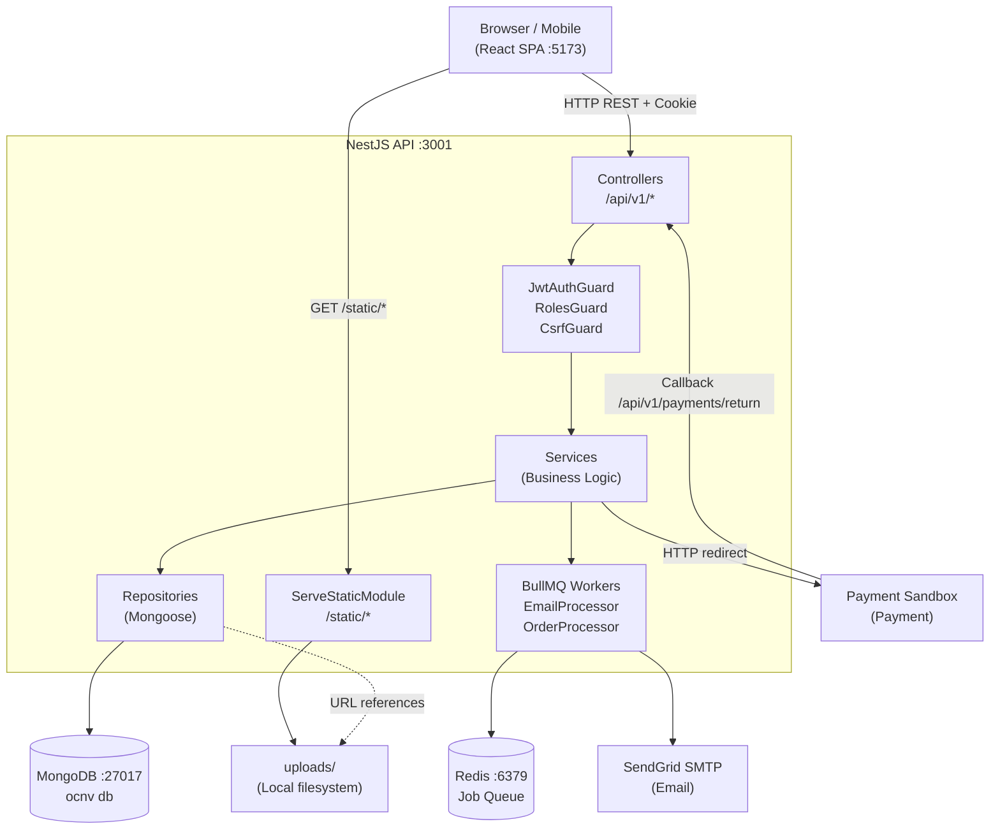

# Architecture

> Dự án: OCNV | Phiên bản: 1.0 — 25/05/2026 | Trạng thái: Approved

---

## 1. System Overview

OCNV là monorepo gồm 2 ứng dụng độc lập: **BE** (NestJS REST API) và **FE** (React SPA). FE giao tiếp với BE hoàn toàn qua HTTP REST (`/api/v1`), auth qua httpOnly cookie. BE kết nối MongoDB cho persistence, Redis cho job queue, và phục vụ file tĩnh từ thư mục `uploads/`. Không có microservice hay event bus — hệ thống single-process đủ cho quy mô v1.

---

## 2. System Diagram



---

## 3. Folder Structure

### Backend (`apps/be/`)

```
apps/be/
  src/
    common/
      decorators/       # @CurrentUser, @Roles, @Public
      filters/          # GlobalExceptionFilter
      guards/           # JwtAuthGuard, RolesGuard, CsrfGuard
      interceptors/     # ResponseTransformInterceptor
      pipes/            # custom pipes
    config/
      config.module.ts
      config.schema.ts  # joi validation
    modules/
      auth/
        auth.module.ts
        auth.controller.ts
        auth.service.ts
        auth.repository.ts
        dto/
        strategies/     # jwt.strategy.ts, jwt-refresh.strategy.ts
      users/
        users.module.ts
        users.controller.ts
        users.service.ts
        users.repository.ts
        dto/
        schemas/user.schema.ts
      addresses/
        ...
      villages/
        ...
      village-stages/
        ...
      products/
        ...
      hotspots/
        ...
      cart/
        ...
      orders/
        ...
      payments/
        payments.module.ts
        payments.controller.ts  # Payment callback endpoint
        payments.service.ts
        payment.helper.ts
      reviews/
        ...
      wishlist/
        ...
      static-content/
        ...
      upload/
        upload.module.ts
        upload.controller.ts
        upload.service.ts   # Multer config, file path logic
      admin/
        dashboard/
          dashboard.module.ts
          dashboard.controller.ts
          dashboard.service.ts
    tasks/
      email.processor.ts
      order.processor.ts
      tasks.module.ts
    app.module.ts
    main.ts
  uploads/
    images/
    models/
    videos/
    ar-tracking/
    avatars/
  test/
    unit/
    integration/
```

### Frontend (`apps/fe/`)

```
apps/fe/
  src/
    features/
      home/
        components/     # HeroSection, FeaturedProducts, VillageCards, ArGuide
        pages/          # HomePage
      products/
        components/     # ModelViewer, HotspotTooltip, ProductGallery, ProductInfo
                        # QuantitySelector, QrCode, VideoPlayer, ReviewList, ReviewForm
        hooks/          # useProduct, useReviews, useCart
        pages/          # ProductDetailPage
      ar/
        components/     # ArScene, ArFallback, ArInfoCard
        pages/          # ArPage
      villages/
        components/     # VillageHero, ArtisanStory, StageTimeline, VillageProducts
        hooks/          # useVillage
        pages/          # VillagePage
      shop/
        components/     # ProductGrid, SearchBar, FilterPanel, SortSelect
        hooks/          # useProducts
        pages/          # ShopPage
      cart/
        components/     # CartItem, OrderSummary
        hooks/          # useCartSync
        pages/          # CartPage
        store/          # cartStore.ts (Zustand)
      checkout/
        components/     # ShippingForm, PaymentSelector, OrderReview
        hooks/          # useCheckout
        pages/          # CheckoutPage, VnpayReturnPage
      orders/
        components/     # OrderTimeline, OrderDetail
        hooks/          # useOrder
        pages/          # OrderDetailPage
      auth/
        components/     # LoginForm, RegisterForm, ResetPasswordForm
        hooks/          # useAuth
        pages/          # LoginPage, RegisterPage, ForgotPasswordPage, ResetPasswordPage
      profile/
        components/     # ProfileForm, AddressList, OrderHistory, WishlistGrid
        hooks/          # useProfile, useAddresses, useWishlist
        pages/          # ProfilePage, OrderHistoryPage, WishlistPage
      admin/
        dashboard/
        products/
        villages/
        orders/
        reviews/
        users/
        static-content/
        components/     # RichTextEditor, FileUpload, DataTable, ChartCard
        hooks/          # useAdminProducts, useAdminOrders, ...
        pages/          # AdminLayout, DashboardPage, ...
    components/
      ui/               # shadcn/ui re-exports
      layout/           # Header, Footer, AdminSidebar, PrivateRoute
    lib/
      api-client.ts     # Axios singleton, interceptors
    hooks/
      useLanguage.ts
    router/
      index.tsx         # route definitions
    store/
      authStore.ts      # Zustand: user session
      languageStore.ts  # Zustand: VI/EN preference
    i18n/
      index.ts
      locales/
        vi.json
        en.json
```

---

## 4. Key Design Decisions

| Quyết định | Lý do |
|-----------|-------|
| **Monorepo (pnpm workspace)** | Chia sẻ type DTO giữa FE/BE, quản lý dependency tập trung, 1 repo dễ CI/CD |
| **Repository pattern** | Tách Mongoose query khỏi business logic — service dễ test (mock repo), dễ swap DB sau này |
| **Embed OrderItem + Payment trong Order** | Tránh join khi query đơn hàng; snapshot giá/tên tại thời điểm đặt, không bị ảnh hưởng khi product thay đổi |
| **File storage local (`uploads/`)** | Đơn giản cho v1, không phụ thuộc cloud service; migrate sang S3-compatible sau khi cần |
| **httpOnly Cookie cho JWT** | Chống XSS lấy token; CSRF handled bằng double-submit cookie pattern |
| **BullMQ cho email** | Email gửi async — không block request checkout/register; retry tự động khi fail |
| **SPA (Vite) thay SSR** | Giảm phức tạp, đủ cho v1; SEO không phải yêu cầu Must trong PRD |
| **Soft delete cho Product** | Đơn hàng cũ vẫn reference product (snapshot text trong OrderItem), nhưng admin cần audit trail |

---

## 5. Auth Flow

```
1. POST /api/v1/auth/login
   → BE set 2 cookies:
     - access_token (httpOnly, 15m)
     - refresh_token (httpOnly, 30d)
     - csrf_token (non-httpOnly, 15m) ← FE đọc và gửi lại trong X-CSRF-Token header

2. Mọi request FE: Axios tự gắn withCredentials=true + X-CSRF-Token header (từ cookie)

3. BE: JwtAuthGuard verify access_token từ cookie
   CsrfGuard verify X-CSRF-Token header khớp csrf_token cookie (chỉ với write requests)

4. Khi access_token hết hạn → Axios interceptor gọi POST /api/v1/auth/refresh
   → BE verify refresh_token cookie → set access_token cookie mới

5. Refresh fail → redirect về /login
```

---

## 6. File Upload Flow

```
1. Admin upload file qua multipart/form-data
2. UploadController nhận file qua FileInterceptor (Multer)
3. UploadService validate type + size → lưu vào uploads/<type>/<uuid>.<ext>
4. Response trả về { url: "/static/<type>/<uuid>.<ext>" }
5. Admin lưu URL vào field tương ứng (product.glbUrl, product.images, ...)
6. FE load file qua URL đó (BE serve qua ServeStaticModule)
```

---

## 7. Payment Payment Flow

```
1. POST /api/v1/orders → tạo Order với payment.status=PENDING
2. POST /api/v1/payments/create-url (orderId)
   → PaymentsService tạo Payment URL (HMAC-SHA512 signature)
   → FE redirect sang Payment sandbox
3. User thanh toán trên Payment
4. Payment redirect về: GET /api/v1/payments/return?vnp_*=...
   → PaymentsService verify signature → cập nhật Order.payment.status
   → FE redirect về /checkout/payment-return
5. (Optional) Payment IPN: POST /api/v1/payments/ipn (server-to-server)
```
